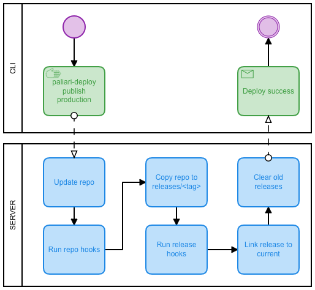

# Paliari deploy

Deploy management tool (deploy, releases and rollback)

## Install

You must install it in your server and your local machine

```bash
sh -c "$(curl -fsSL https://raw.githubusercontent.com/paliari-ti/paliari-deploy/master/install.sh)"
```

## Lifecycle



## Config

Create a directory `.deploy` in the root of your project. Inside, you must create the follow files:

- `stage-<stage-n>.yml` Configuration for each application you want deploy, ex: `stage-demo.yml, stage-production.yml`
- `hooks.yml` Hooks to be executed in all stages

#### Stage options

- `remote`: Config about your remote server to be deployed
    - `user`: The user of your remote server
    - `host`: The host to be deployed
    - `path`: The directory inside your server
- `publish`: Specifies the method to use to deploy (Choose one: `git`, `scp` or `script`)
    - `git`: On deploy, the `repo` will be updated in the remote server and generate a release
        - `url`: Url of your git repository
        - `branch`: Branch to use to deploy. Optional, default: `master`
    - `scp`: On deploy, the the path will be copied by _scp_ to `repo/dist` of your remote server and generate a release
        - `path`: Directory as source to copy files (ex: `./dist`)
    - `script`: Run any bash script you want

#### Hook options

- `hooks`: Hun custom hooks such _dependencies_ or _migrations_ and others
    - `repo`: Array of hooks to run sequentially after repo has been updated
        - `script 1`
        - `script 2`
        - `script n`
    - `releases`: Array of hooks to run sequentially after release has been generated. (After link shared directories and environment variables but not in production yet)
        - `script 1`
        - `script 2`
        - `script n`

## Examples

#### `.deploy/stage-production.yml` using git

```yml
deploy:
  remote:
    user: user-name
    host: paliari.com.br
    path: /home/apps/my-app
  publish:
    git:
      url: git@git.paliari.com.br:paliari/my-repo.git
      branch: master
```

#### `.deploy/stage-production.yml` using scp

```yml
deploy:
  remote:
    user: user-name
    host: paliari.com.br
    path: /home/apps/my-app
  publish:
    scp:
      path: ./dist
```

#### `.deploy/hooks.yml` using _php_ and _doctrine_

```yaml
deploy:
  hooks:
    repo:
      - composer install
    releases:
      - vendor/bin/doctrine-migrations migrations:migrate
```

## But wait, how do I use this?

```bash
$ paliari-deploy <action> <stage> <other-options>
```

#### Actions

- `init`: Creates the folder structure in the remote server
  
    > Attention: if you run `init` in a already existent directory, it will override the repo directory

- `publish`: Publishes a release in the remote server
- `releases`: Get a list of releases from the remote server
- `rollback`: Rollback the application to a previous version

#### More Examples

```bash
paliari-deploy init production
```

```bash
paliari-deploy publish production
```

```bash
paliari-deploy releases production
```

```bash
paliari-deploy rollback production 1544013652
```

## How is the folder structure on the server

```text
├── current -> /my-app/releases/20150120114500/
├── releases
│   ├── 1544013638
│   ├── 1544013652
│   ├── 1544013972
│   ├── 1544013984
│   ├── 1544014015
│   ├── 1544015076
│   ├── 1544015152
│   ├── 1544016181
│   └── 1544016181
├── repo
│   └── <GIT related data>
└── shared
    └── <linked_files and linked_dirs>
```
